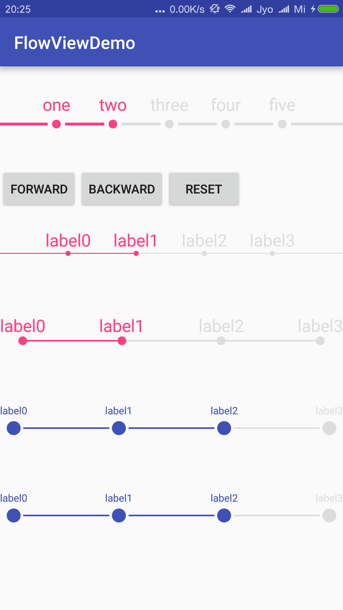

FLowViewDemo
========

流程图效果，可以用在订单步骤等方面。

 
 
 
 
 		<com.ginsmile.flowviewdemo.FlowView
        android:id="@+id/fv"
        android:layout_width="match_parent"
        android:layout_height="100dp"
        app:circle_raidus="5dp"
        app:circle_padding="5dp"
        app:line_height="3dp"
        app:done_color="@color/colorAccent"
        app:todo_color="@color/colorGrey"
        app:text_size="10pt"
        app:text_padding="5dp"
        app:is_has_start_end_line="true"
        app:flow_nums="4"
        app:done_nums="2"
        />
        

解释：

* app:circle_raidus="5dp" 圆圈半径
* app:circle_padding="5dp" 圈圈边界到线段的距离
* app:line_height="3dp" 线段高度
* app:done_color="@color/colorAccent" 已完成部分的颜色
* app:todo_color="@color/colorGrey" 未完成部分的颜色
* app:text_size="10pt" 字体大小
* app:text_padding="5dp" 字和圆圈之间的距离（注意：circle_padding另算，即字的下边界到圆圈的上边界的距离为text_padding + circle_padding）
* app:is_has_start_end_line="true" 是否有两边的线段
* app:flow_nums="4" 总的圆圈个数
* app:done_nums="2" 已完成的个数

        
        
        
        
        
        
        
        
        
        
        
        
        
        
        
        
        
        
        